# FOSSEE Workshop Booking - UI/UX Redesign

## Setup Instructions

### Django Backend
```bash
python -m venv venv
source venv/bin/activate.fish  # fish shell
pip install -r requirements.txt
python manage.py migrate
python manage.py runserver
```

### React Frontend
```bash
cd frontend
npm install
npm start
```

Frontend runs at `http://localhost:3000`

---

## Design Reasoning

### What design principles guided your improvements?
The redesign was guided by three main principles:
1. **Mobile-first layout**: Since the primary users are students accessing from phones, every component was built at small screen size first and scaled up.
2. **Visual hierarchy**: Clear separation between the hero CTA, section headings, and card content so users instantly know where to look.
3. **Accessibility**: Semantic HTML tags, aria-labels on interactive elements, and sufficient color contrast throughout.

### How did you ensure responsiveness across devices?
I used Tailwind's responsive prefixes (`sm:`, `md:`, `lg:`) on every layout component. The workshop grid seamlessly transitions from `grid-cols-1` on mobile to `sm:grid-cols-2` on tablets and `lg:grid-cols-3` on desktops. Additionally, the navbar safely collapses into a responsive hamburger menu below the `md` breakpoint using React state.

### What trade-offs did you make between the design and performance?
I deliberately chose Tailwind utility classes over heavy component libraries like Material UI to keep the bundle small and load times fast on mobile connections. This meant writing slightly more markup per component, but avoided shipping hundreds of kilobytes of unused layout styles.

### What was the most challenging part of the task and how did you approach it?
The existing Django codebase used `django.conf.urls.url`, which was completely removed in Django 4.x. Getting the original legacy site running to study its logic required correctly patching all URL files to use `re_path` and `path` instead. Once the original site was running, carefully mapping its legacy pages to the new interactive React components while keeping the same intuitive user flow intact was the primary design challenge.

---

## Before & After Visual Showcase

| View | Before (Django) | After (React UI) |
|---|---|---|
| Home (Desktop) |  | 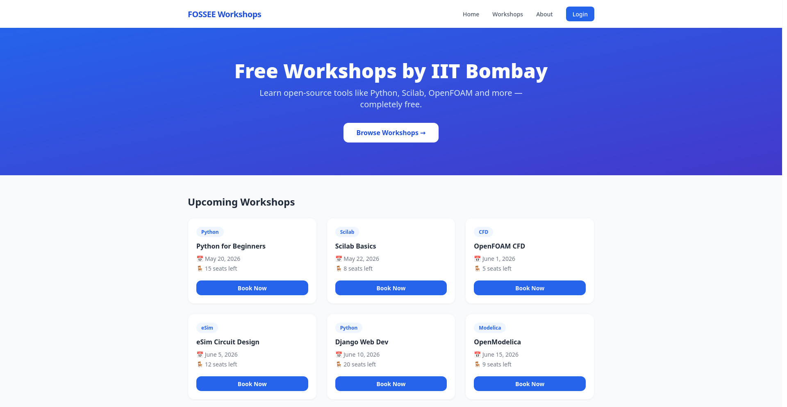 |
| Home (Mobile) | 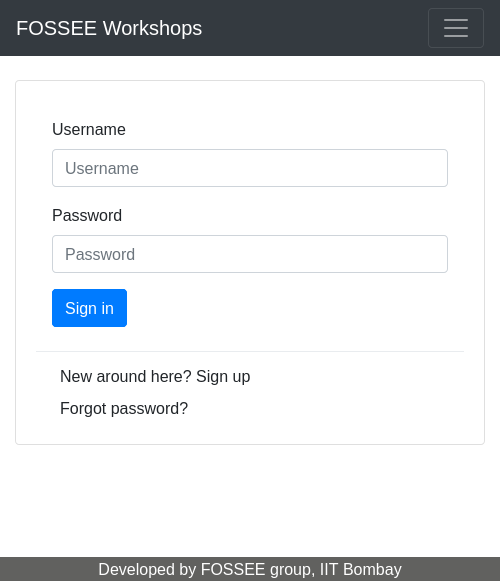 | 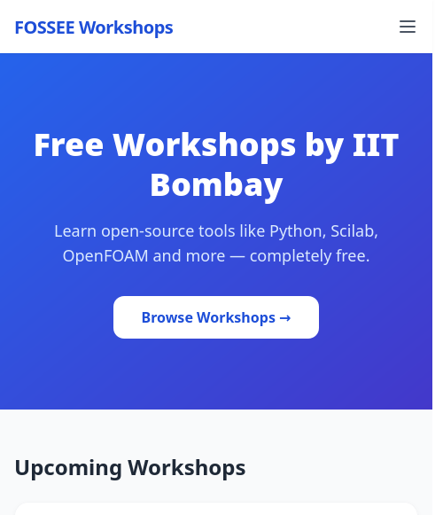 |
| Workshop Cards (Desktop) | 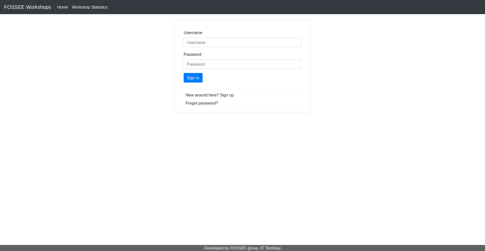 | 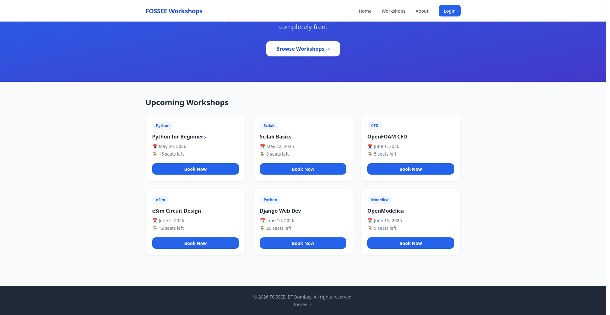 |
| Workshop Cards (Mobile) | | 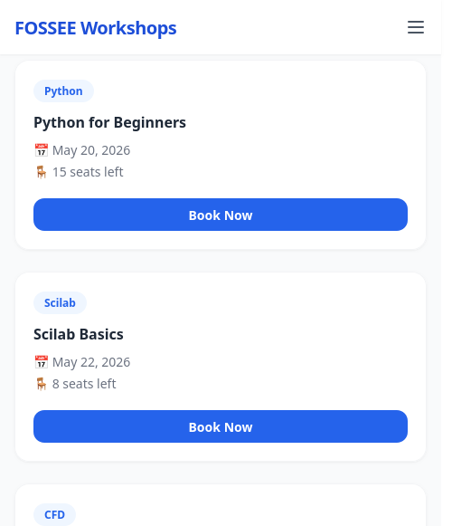 |
| Navbar (Desktop) | | 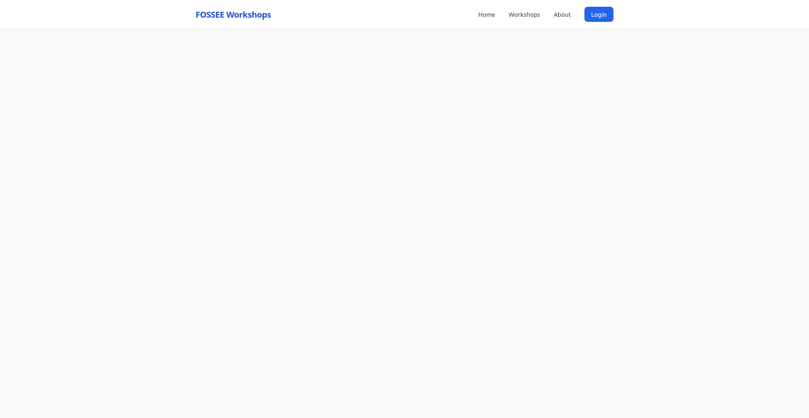 |
| Navbar (Mobile) | | 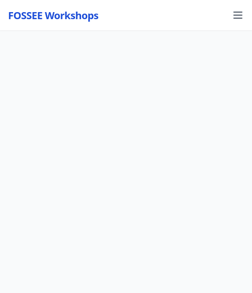 |
| Statistics Page | 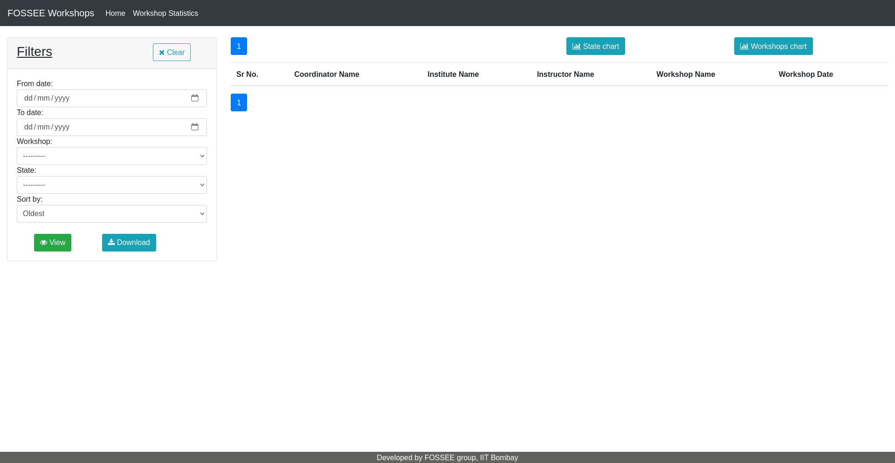 | |
| Workshop Types | 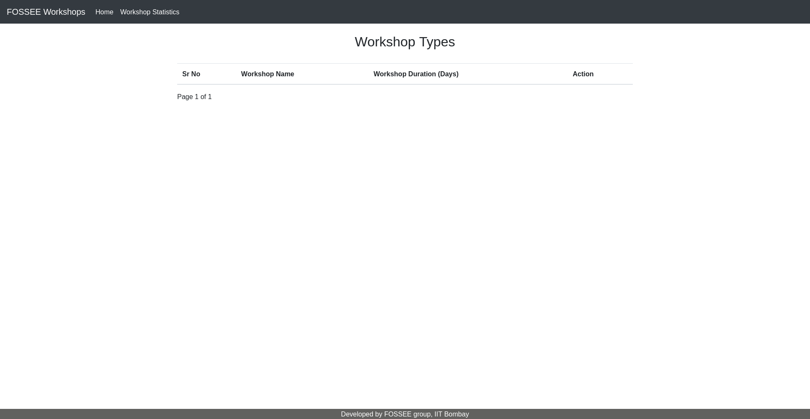 | |
| Login Page |  | |
| Registration Page | 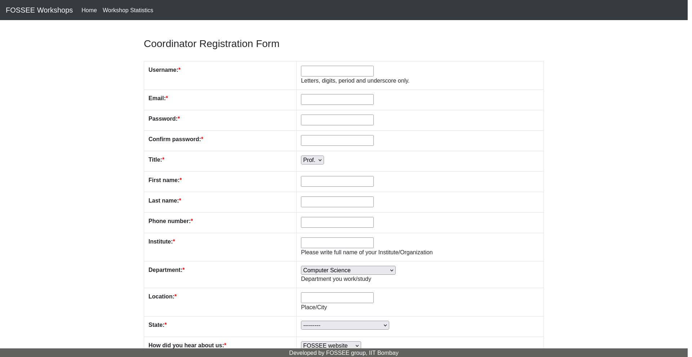 | |
| CMS Platform | 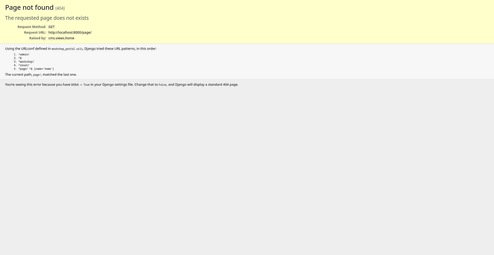 | |

